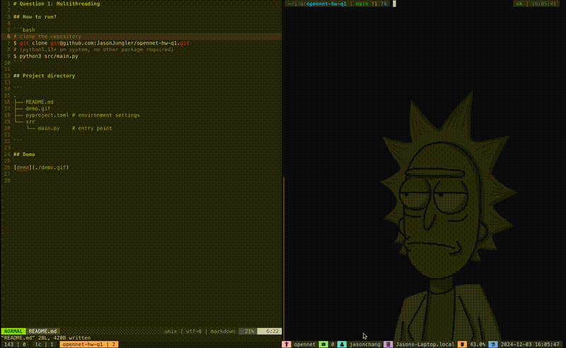

# Question 1: Multithreading

## How to run?

```bash
# clone the repository
$ git clone git@github.com:JasonJungler/opennet-hw-q1.git
# (python3.13+ on system, no other package required)
$ python3 src/main.py
```

## Project directory

```
.
├── README.md 
├── demo.gif
├── pyproject.toml # environment settings
└── src
    └── main.py    # entry point

```

## Demo




